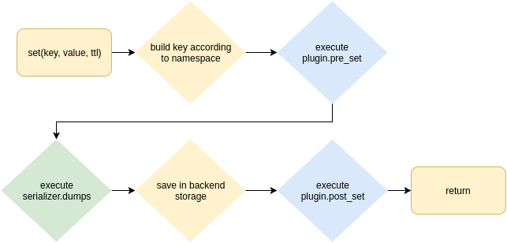

aiocache
########

Asyncio cache supporting multiple backends (memory, redis and memcached).

.. image:: https://travis-ci.org/argaen/aiocache.svg?branch=master
  :target: https://travis-ci.org/argaen/aiocache

.. image:: https://codecov.io/gh/argaen/aiocache/branch/master/graph/badge.svg
  :target: https://codecov.io/gh/argaen/aiocache

.. image:: https://badge.fury.io/py/aiocache.svg
  :target: https://pypi.python.org/pypi/aiocache

.. image:: https://img.shields.io/pypi/pyversions/aiocache.svg
  :target: https://pypi.python.org/pypi/aiocache

.. image:: https://api.codacy.com/project/badge/Grade/96f772e38e63489ca884dbaf6e9fb7fd
  :target: https://www.codacy.com/app/argaen/aiocache

.. image:: https://img.shields.io/badge/code%20style-black-000000.svg
    :target: https://github.com/ambv/black

This library aims for simplicity over specialization. All caches contain the same minimum interface which consists on the following functions:

- ``add``: Only adds key/value if key does not exist.
- ``get``: Retrieve value identified by key.
- ``set``: Sets key/value.
- ``multi_get``: Retrieves multiple key/values.
- ``multi_set``: Sets multiple key/values.
- ``exists``: Returns True if key exists False otherwise.
- ``increment``: Increment the value stored in the given key.
- ``delete``: Deletes key and returns number of deleted items.
- ``clear``: Clears the items stored.
- ``raw``: Executes the specified command using the underlying client.

.. role:: python(code)
  :language: python

.. contents::

.. section-numbering:

Installing
==========

- ``pip install aiocache``
- ``pip install aiocache[redis]``
- ``pip install aiocache[memcached]``
- ``pip install aiocache[redis,memcached]``
- ``pip install aiocache[msgpack]``

Usage
=====

Using a cache is as simple as

.. code-block:: python

    >>> import asyncio
    >>> loop = asyncio.get_event_loop()
    >>> from aiocache import Cache
    >>> cache = Cache(Cache.MEMORY) # Here you can also use Cache.REDIS and Cache.MEMCACHED, default is Cache.MEMORY
    >>> loop.run_until_complete(cache.set('key', 'value'))
    True
    >>> loop.run_until_complete(cache.get('key'))
    'value'

Or as a decorator

.. code-block:: python

    import asyncio

    from collections import namedtuple

    from aiocache import cached, Cache
    from aiocache.serializers import PickleSerializer
    # With this we can store python objects in backends like Redis!

    Result = namedtuple('Result', "content, status")

    @cached(
        ttl=10, cache=Cache.REDIS, key="key", serializer=PickleSerializer(), port=6379, namespace="main")
    async def cached_call():
        print("Sleeping for three seconds zzzz.....")
        await asyncio.sleep(3)
        return Result("content", 200)

    def run():
        loop = asyncio.get_event_loop()
        loop.run_until_complete(cached_call())
        loop.run_until_complete(cached_call())
        loop.run_until_complete(cached_call())
        cache = Cache(Cache.REDIS, endpoint="127.0.0.1", port=6379, namespace="main")
        loop.run_until_complete(cache.delete("key"))

    if __name__ == "__main__":
        run()

The recommended approach to instantiate a new cache is using the `Cache` constructor. However you can also instantiate directly using `aiocache.RedisCache`, `aiocache.SimpleMemoryCache` or `aiocache.MemcachedCache`.

You can also setup cache aliases so its easy to reuse configurations

.. code-block:: python

  import asyncio

  from aiocache import caches

  # You can use either classes or strings for referencing classes
  caches.set_config({
      'default': {
          'cache': "aiocache.SimpleMemoryCache",
          'serializer': {
              'class': "aiocache.serializers.StringSerializer"
          }
      },
      'redis_alt': {
          'cache': "aiocache.RedisCache",
          'endpoint': "127.0.0.1",
          'port': 6379,
          'timeout': 1,
          'serializer': {
              'class': "aiocache.serializers.PickleSerializer"
          },
          'plugins': [
              {'class': "aiocache.plugins.HitMissRatioPlugin"},
              {'class': "aiocache.plugins.TimingPlugin"}
          ]
      }
  })

  async def default_cache():
      cache = caches.get('default')   # This always returns the SAME instance
      await cache.set("key", "value")
      assert await cache.get("key") == "value"

  async def alt_cache():
      cache = caches.create('redis_alt')   # This creates a NEW instance on every call
      await cache.set("key", "value")
      assert await cache.get("key") == "value"

  def test_alias():
      loop = asyncio.get_event_loop()
      loop.run_until_complete(default_cache())
      loop.run_until_complete(alt_cache())

      loop.run_until_complete(caches.get('redis_alt').delete("key"))

  if __name__ == "__main__":
      test_alias()

How does it work
================

Aiocache provides 3 main entities:

- **backends**: Allow you specify which backend you want to use for your cache. Currently supporting: SimpleMemoryCache, RedisCache using aioredis_ and MemCache using aiomcache_.
- **serializers**: Serialize and deserialize the data between your code and the backends. This allows you to save any Python object into your cache. Currently supporting: StringSerializer, PickleSerializer, JsonSerializer, and MsgPackSerializer. But you can also build custom ones.
- **plugins**: Implement a hooks system that allows to execute extra behavior before and after of each command.

 If you are missing an implementation of backend, serializer or plugin you think it could be interesting for the package, do not hesitate to open a new issue.

.. image:: docs/images/architecture.png
  :align: center

Those 3 entities combine during some of the cache operations to apply the desired command (backend), data transformation (serializer) and pre/post hooks (plugins). To have a better vision of what happens, here you can check how ``set`` function works in ``aiocache``:

Amazing examples
================

In `examples folder <https://github.com/argaen/aiocache/tree/master/examples>`_ you can check different use cases:

- `Sanic, Aiohttp and Tornado <https://github.com/argaen/aiocache/tree/master/examples/frameworks>`_
- `Python object in Redis <https://github.com/argaen/aiocache/blob/master/examples/python_object.py>`_
- `Custom serializer for compressing data <https://github.com/argaen/aiocache/blob/master/examples/serializer_class.py>`_
- `TimingPlugin and HitMissRatioPlugin demos <https://github.com/argaen/aiocache/blob/master/examples/plugins.py>`_
- `Using marshmallow as a serializer <https://github.com/argaen/aiocache/blob/master/examples/marshmallow_serializer_class.py>`_
- `Using cached decorator <https://github.com/argaen/aiocache/blob/master/examples/cached_decorator.py>`_.
- `Using multi_cached decorator <https://github.com/argaen/aiocache/blob/master/examples/multicached_decorator.py>`_.

Documentation
=============

- `Usage <http://aiocache.readthedocs.io/en/latest>`_
- `Caches <http://aiocache.readthedocs.io/en/latest/caches.html>`_
- `Serializers <http://aiocache.readthedocs.io/en/latest/serializers.html>`_
- `Plugins <http://aiocache.readthedocs.io/en/latest/plugins.html>`_
- `Configuration <http://aiocache.readthedocs.io/en/latest/configuration.html>`_
- `Decorators <http://aiocache.readthedocs.io/en/latest/decorators.html>`_
- `Testing <http://aiocache.readthedocs.io/en/latest/testing.html>`_
- `Examples <https://github.com/argaen/aiocache/tree/master/examples>`_

.. _aioredis: https://github.com/aio-libs/aioredis
.. _aiomcache: https://github.com/aio-libs/aiomcache
