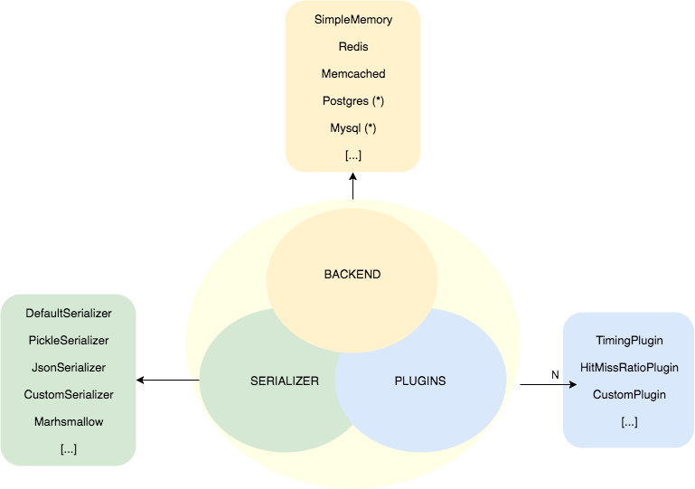

aiocache
========

.. image:: https://travis-ci.org/argaen/aiocache.svg?branch=master
  :target: https://travis-ci.org/argaen/aiocache

.. image:: https://codecov.io/gh/argaen/aiocache/branch/master/graph/badge.svg
  :target: https://codecov.io/gh/argaen/aiocache

.. image:: https://badge.fury.io/py/aiocache.svg
  :target: https://pypi.python.org/pypi/aiocache

.. image:: https://img.shields.io/pypi/pyversions/aiocache.svg
  :target: https://pypi.python.org/pypi/aiocache

**Aiocache is in beta version so breaking changes may be introduced in upcoming versions**.

The asyncio cache that implements multiple backends.

This library aims for simplicity over specialization. It provides a common interface for all caches which allows to store any python object. The operations supported by all backends are:

- ``add``
- ``exists``
- ``get``
- ``set``
- ``multi_get``
- ``multi_set``
- ``delete``
- ``clear``
- ``raw``: Sends raw command to the underlying client

How does it work
----------------

Aiocache provides 3 main entities:

- **backends**: Allow you specify which backend you want to use for your cache. Currently supporting: SimpleMemoryCache, RedisCache using aioredis_ and MemCache using aiomcache_.
- **serializers**: Serialize and deserialize the data between your code and the backends. This allows you to save any Python object into your cache. Currently supporting: DefaultSerializer, PickleSerializer, JsonSerializer.
- **plugins**: Implement a hooks system that allows to execute extra behavior before and after of each command.

Those 3 entities combine during some of the cache operations to apply the desired command (backend), data transformation (serializer) and pre/post hooks (plugins). To have a better vision of what happens, here you can check how ``set`` function works in ``aiocache``:

.. image:: docs/images/set_operation_flow.png
  :align: center

Usage
-----

Install the package with ``pip install aiocache``.

simple redis
~~~~~~~~~~~~

.. code-block:: python

  import asyncio

  from aiocache import RedisCache

  cache = RedisCache(endpoint="127.0.0.1", port=6379, namespace="main")

  async def redis():
      await cache.set("key", "value")
      await cache.set("expire_me", "value", ttl=10)

      assert await cache.get("key") == "value"
      assert await cache.get("expire_me") == "value"
      assert await cache.raw("ttl", "main:expire_me") > 0

  def test_redis():
      loop = asyncio.get_event_loop()
      loop.run_until_complete(redis())
      loop.run_until_complete(cache.delete("key"))
      loop.run_until_complete(cache.delete("expire_me"))

  if __name__ == "__main__":
      test_redis()

cached decorator
~~~~~~~~~~~~~~~~

.. code-block:: python

  import asyncio

  from collections import namedtuple

  from aiocache import cached, RedisCache
  from aiocache.serializers import PickleSerializer

  Result = namedtuple('Result', "content, status")

  @cached(ttl=10, cache=RedisCache, serializer=PickleSerializer())
  async def async_main():
      print("First ASYNC non cached call...")
      await asyncio.sleep(1)
      return Result("content", 200)

  if __name__ == "__main__":
      loop = asyncio.get_event_loop()
      print(loop.run_until_complete(async_main()))
      print(loop.run_until_complete(async_main()))
      print(loop.run_until_complete(async_main()))
      print(loop.run_until_complete(async_main()))

The decorator by default will use the ``SimpleMemoryCache`` backend and the ``DefaultSerializer``. If you want to use a different backend, you can call it with ``cached(ttl=10, backend=RedisCache)``. Also, if you want to use a specific serializer just use ``cached(ttl=10, serializer=DefaultSerializer())``

Documentation
-------------

- `Usage <http://aiocache.readthedocs.io/en/latest/usage.html>`_
- `Caches <http://aiocache.readthedocs.io/en/latest/caches.html>`_
- `Serializers <http://aiocache.readthedocs.io/en/latest/serializers.html>`_
- `Plugins <http://aiocache.readthedocs.io/en/latest/plugins.html>`_
- `Decorators <http://aiocache.readthedocs.io/en/latest/decorators.html>`_
- `Testing <http://aiocache.readthedocs.io/en/latest/testing.html>`_
- `Examples <https://github.com/argaen/aiocache/tree/master/examples>`_

.. _aioredis: https://github.com/aio-libs/aioredis
.. _aiomcache: https://github.com/aio-libs/aiomcache
